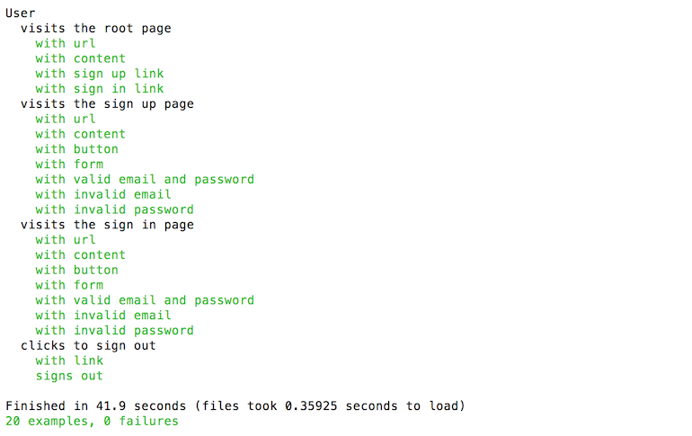

# user-tests 
* Achieved 100% coverage of sign in, sign up, and sign out codebase by writing feature specs utilizing RSpec, Capybara and Selenium to exclusively test external interface.

## Project Summary
* Technologies: Ruby 2.4.2
* Gems: RSpec, Capybara, Selenium Webdriver, Chromedriver Helper

## Instructions to Run Tests
Install dependencies: 

```
$ bundle install
``` 

Run tests: 

```
$ rspec --format documentation
```

## Gotchas
* Requires Chrome version 49 or newer to run tests

## Test Output

