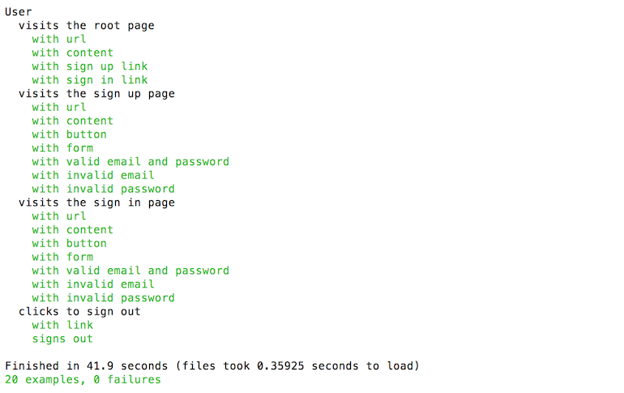

# tests-external-interface 
* Achieved 100% coverage of sign in, sign up, and sign out codebase by writing feature specs utilizing RSpec, Capybara and Selenium to exclusively test external interface.

## Project Summary
* Technologies: Ruby 2.4.2
* Gems: RSpec, Capybara, Selenium Webdriver, Chromedriver Helper

## Instructions to Run Tests
Install dependencies: 

```
$ bundle install
``` 

Run tests: 

* Use the progress formatter (generates '.' which represents a passing example, 'F' is failing, and '*' is pending):

```
$ rspec --format
```

* Use the documentation formatter to see the documentation strings passed to
describe, it, and their aliases:

```
$ rspec --format documentation
```

## Test Output


## Notes
* Requires Chrome version 49 or newer to run tests
